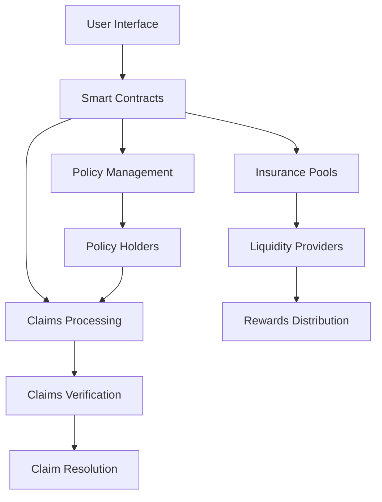

# FortiFi: Decentralized Insurance Protocol

FortiFi is a next-generation decentralized insurance protocol built on blockchain technology, offering transparent, efficient, and automated insurance solutions for digital assets and smart contracts.

## 🌟 Overview

FortiFi revolutionizes traditional insurance by leveraging blockchain technology to create a trustless, automated insurance ecosystem. Users can create insurance pools, purchase policies, and process claims without intermediaries, all while ensuring maximum transparency and efficiency.

## 🔑 Key Features

- **Decentralized Insurance Pools**: Create and manage insurance pools with customizable parameters
- **Automated Policy Management**: Smart contract-based policy issuance and management
- **Transparent Claims Processing**: Verifiable claims assessment and processing
- **Liquidity Provider Incentives**: Earn rewards by providing liquidity to insurance pools

## 🔄 System Architecture



## 🌊 Insurance Flow

```
┌──────────────┐     ┌──────────────┐     ┌──────────────┐
│   Create     │     │   Purchase   │     │   Submit     │
│    Pool      │ --> │   Policy     │ --> │   Claim      │
└──────────────┘     └──────────────┘     └──────────────┘
       ↑                    │                    │
       │                    ↓                    ↓
┌──────────────┐     ┌──────────────┐     ┌──────────────┐
│  Liquidity   │     │   Active     │     │   Verify     │
│  Providers   │     │  Coverage    │     │   Claim      │
└──────────────┘     └──────────────┘     └──────────────┘
                                                │
                                                ↓
                                         ┌──────────────┐
                                         │  Process     │
                                         │  Payout      │
                                         └──────────────┘
```

## 🛠 Technology Stack

- **Frontend**: Next.js, TailwindCSS, Framer Motion
- **Blockchain**: Ethereum, Solidity
- **Web3 Integration**: Wagmi, Ethers.js
- **Storage**: IPFS (for claim documents)
- **UI Components**: Custom-built with modern design principles

## 🚀 Getting Started

1. Clone the repository:
```bash
git clone https://github.com/yourusername/fortifi.git
cd fortifi
```

2. Install dependencies:
```bash
npm install
```

3. Set up environment variables:
```bash
cp .env.example .env.local
# Edit .env.local with your configuration
```

4. Run the development server:
```bash
npm run dev
```

## 💻 Smart Contract Deployment

1. Configure your network in `hardhat.config.js`
2. Deploy contracts:
```bash
npx hardhat run scripts/deploy.js --network <your-network>
```

## Deployments

1. [Demo](https://forti-fi-six.vercel.app/)  
2. [SafeToken Contract](https://edu-chain-testnet.blockscout.com/address/0x1D055d65a625d8544ac9D4edF3109fB78A72e6E4)
3. [InsurancePool Contract](https://edu-chain-testnet.blockscout.com/address/0xf6B36e65F075556619C4f88D5B0b2bC2FECb0B73?tab=index)
4. [PolicyManager Contract](https://edu-chain-testnet.blockscout.com/address/0x24375C2eeef58Fb8752C00BBa4bE350cCE682c30)

